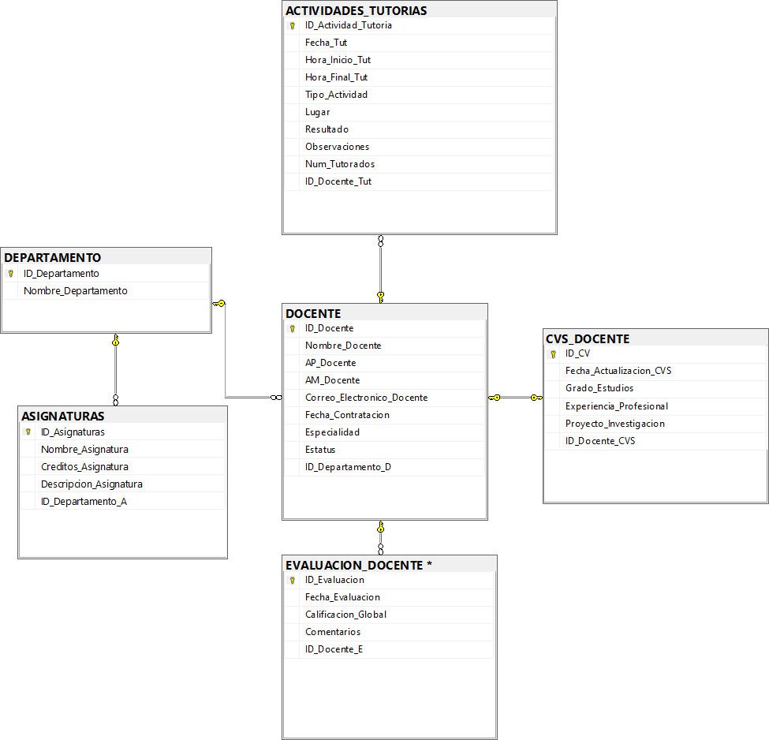

# Documentación de la Base de Datos: Desarrollo Académico

## Descripción general del proyecto

Esta base de datos está diseñada para gestionar la información relacionada con el desarrollo académico y la administración del personal docente dentro de una institución educativa.

El modelo se centra en la entidad **DOCENTE** como eje central, permitiendo un seguimiento detallado de sus afiliaciones departamentales (`DEPARTAMENTO`), las asignaturas (`ASIGNATURAS`) que imparte dicho departamento, y las actividades clave del docente: su currículum (`CVS_DOCENTE`), sus evaluaciones de desempeño (`EVALUACION_DOCENTE`) y las actividades de tutoría (`ACTIVIDADES_TUTORIAS`) que realiza.

## Estructura del modelo

El modelo de datos se compone de 6 tablas principales:

* **DEPARTAMENTO**: Tabla maestra que cataloga las divisiones académicas o administrativas de la institución.
* **ASIGNATURAS**: Catálogo de todas las materias o cursos que ofrece la institución, vinculadas a un departamento.
* **DOCENTE**: Tabla central que contiene la información personal y profesional de cada miembro del personal docente.
* **CVS_DOCENTE**: Tabla de detalle que almacena la información curricular extendida de un docente (formación, experiencia, etc.).
* **EVALUACION_DOCENTE**: Registro transaccional de las evaluaciones de desempeño realizadas a los docentes (presumiblemente por estudiantes).
* **ACTIVIDADES_TUTORIAS**: Registro transaccional de las sesiones de tutoría y actividades de apoyo que un docente imparte.

## Relaciones entre tablas

El diseño sigue un modelo relacional centrado en las tablas `DEPARTAMENTO` y `DOCENTE`, estableciendo las siguientes relaciones:

* **Uno a Muchos (1:N)**
    * `DEPARTAMENTO` a `DOCENTE`: Un departamento puede tener múltiples docentes asignados.
        * *Llave:* `DOCENTE.ID_Departamento_D` -> `DEPARTAMENTO.ID_Departamento`
    * `DEPARTAMENTO` a `ASIGNATURAS`: Un departamento imparte múltiples asignaturas.
        * *Llave:* `ASIGNATURAS.ID_Departamento_A` -> `DEPARTAMENTO.ID_Departamento`
    * `DOCENTE` a `EVALUACION_DOCENTE`: Un docente puede recibir múltiples evaluaciones a lo largo del tiempo.
        * *Llave:* `EVALUACION_DOCENTE.ID_Docente_E` -> `DOCENTE.ID_Docente`
    * `DOCENTE` a `ACTIVIDADES_TUTORIAS`: Un docente puede registrar múltiples actividades de tutoría.
        * *Llave:* `ACTIVIDADES_TUTORIAS.ID_Docente_Tut` -> `DOCENTE.ID_Docente`

* **Uno a Uno (1:1)**
    * `DOCENTE` a `CVS_DOCENTE`: Se espera que cada docente tenga un único registro de CV asociado.
    * *Llave:* `CVS_DOCENTE.ID_Docente_CVS` -> `DOCENTE.ID_Docente`
    * *Implementación:* Esta relación se fuerza a nivel de base de datos mediante una restricción `UNIQUE` en la columna `ID_Docente_CVS`.

## Diagrama lógico

## Descripción de cada tabla

A continuación, se detalla la estructura y propósito de cada tabla definida en el script SQL.

### 1. DEPARTAMENTO

Almacena los departamentos académicos de la institución.

| Atributo | Tipo de Dato | Descripción |
| :--- | :--- | :--- |
| **ID_Departamento** | **INT IDENTITY(1,1)** | **Llave Primaria (PK).** Identificador único del departamento. |
| Nombre_Departamento | VARCHAR(80) NOT NULL | Nombre oficial del departamento. |

### 2. ASIGNATURAS

Catálogo de materias, cursos o asignaturas.

| Atributo | Tipo de Dato | Descripción |
| :--- | :--- | :--- |
| **ID_Asignaturas** | **INT IDENTITY(1,1)** | **Llave Primaria (PK).** Identificador único de la asignatura. |
| Nombre_Asignatura | VARCHAR(100) NOT NULL | Nombre oficial de la asignatura. |
| Creditos_Asignatura | TINYINT NOT NULL | Número de créditos. Restringido a `> 0`. |
| Descripcion_Asignatura | VARCHAR(MAX) | Descripción o temario de la asignatura. |
| **ID_Departamento_A** | **INT NOT NULL** | **Llave Foránea (FK).** Referencia a `DEPARTAMENTO(ID_Departamento)`. |

### 3. DOCENTE

Información central del personal docente.

| Atributo | Tipo de Dato | Descripción |
| :--- | :--- | :--- |
| **ID_Docente** | **INT IDENTITY(1,1)** | **Llave Primaria (PK).** Identificador único del docente. |
| Nombre_Docente | VARCHAR(50) NOT NULL | Nombre(s) del docente. |
| AP_Docente | VARCHAR(50) NOT NULL | Apellido paterno del docente. |
| AM_Docente | VARCHAR(50) | Apellido materno del docente. |
| Correo_Electronico_Docente | VARCHAR(100) | Correo institucional o de contacto. |
| Fecha_Contratacion | DATE NOT NULL | Fecha en que el docente se unió a la institución. |
| Especialidad | VARCHAR(100) | Área principal de experiencia o estudio del docente. |
| Estatus | VARCHAR(20) NOT NULL | Situación contractual. `DEFAULT 'Activo'`. Restringido a ('Activo', 'Inactivo', 'Jubilado'). |
| **ID_Departamento_D** | **INT NOT NULL** | **Llave Foránea (FK).** Referencia a `DEPARTAMENTO(ID_Departamento)`. |

### 4. CVS_DOCENTE

Detalles curriculares del docente.

| Atributo | Tipo de Dato | Descripción |
| :--- | :--- | :--- |
| **ID_CV** | **INT IDENTITY(1,1)** | **Llave Primaria (PK).** Identificador único del registro de CV. |
| Fecha_Actualizacion_CVS | DATE NOT NULL | Fecha de la última modificación. `DEFAULT GETDATE()`. |
| Grado_Estudios | VARCHAR(50) NOT NULL | Máximo grado académico (ej. 'Licenciatura', 'Maestría'). |
| Experiencia_Profesional | VARCHAR(MAX) | Descripción de la experiencia laboral relevante. |
| Proyecto_Investigacion | VARCHAR(MAX) | Descripción de proyectos de investigación. |
| **ID_Docente_CVS** | **INT NOT NULL** | **Llave Foránea (FK) y Única (UNIQUE).** Referencia a `DOCENTE(ID_Docente)`. |

### 5. EVALUACION_DOCENTE

Registro de las evaluaciones de desempeño docente.

| Atributo | Tipo de Dato | Descripción |
| :--- | :--- | :--- |
| **ID_Evaluacion** | **INT IDENTITY(1,1)** | **Llave Primaria (PK).** Identificador único de la evaluación. |
| Fecha_Evaluacion | DATE NOT NULL | Fecha de la evaluación. `DEFAULT GETDATE()`. |
| Calificacion_Global | DECIMAL(4,2) NOT NULL | Puntuación numérica. Restringida a un rango `BETWEEN 0 AND 10`. |
| Comentarios | VARCHAR(MAX) | Comentarios cualitativos de la evaluación. |
| **ID_Docente_E** | **INT NOT NULL** | **Llave Foránea (FK).** Referencia a `DOCENTE(ID_Docente)`. |
| **ID_Estudiante_E** | **INT NOT NULL** | ID del estudiante que evalúa. *(Ver Posibles Mejoras)*. |

*Nota: Esta tabla tiene una restricción `UNIQUE` en `(ID_Docente_E, ID_Estudiante_E, Fecha_Evaluacion)` para evitar evaluaciones duplicadas.*

### 6. ACTIVIDADES_TUTORIAS

Registro de las actividades de tutoría.

| Atributo | Tipo de Dato | Descripción |
| :--- | :--- | :--- |
| **ID_Actividad_Tutoria** | **INT IDENTITY(1,1)** | **Llave Primaria (PK).** Identificador único de la actividad. |
| Fecha_Tut | DATE NOT NULL | Fecha de la tutoría. |
| Hora_Inicio_Tut | TIME(0) NOT NULL | Hora de inicio de la actividad. |
| Hora_Final_Tut | TIME(0) NOT NULL | Hora de finalización. Restringida a ser `> Hora_Inicio_Tut`. |
| Tipo_Actividad | VARCHAR(50) NOT NULL | Categoría de la tutoría (ej. 'Académica', 'Personal'). |
| Lugar | VARCHAR(80) | Ubicación donde se realizó la tutoría. |
| Resultado | VARCHAR(MAX) | Breve descripción del resultado o seguimiento. |
| Observaciones | VARCHAR(MAX) | Notas adicionales sobre la sesión. |
| Num_Tutorados | TINYINT | Cantidad de estudiantes. Restringido a `> 0`. |
| **ID_Docente_Tut** | **INT NOT NULL** | **Llave Foránea (FK).** Referencia a `DOCENTE(ID_Docente)`. |

## Consideraciones del diseño

1.  **Integridad de Datos (Constraints):** El diseño hace un uso excelente de las restricciones (`CHECK`) para aplicar reglas de negocio directamente en la base de datos (ej. `CK_Calificacion_Rango`, `CK_Horas_Validas`). Esto es superior a depender únicamente de la lógica de la aplicación para garantizar datos válidos.
2.  **Manejo de Llaves Primarias:** El uso de `INT IDENTITY(1,1)` para todas las llaves primarias es una práctica estándar y eficiente en SQL Server, ya que delega la generación de IDs únicos al motor de la base de datos.
3.  **Implementación de Relación 1:1:** La relación uno-a-uno entre `DOCENTE` y `CVS_DOCENTE` está correctamente implementada usando una llave foránea (`ID_Docente_CVS`) que también tiene una restricción `UNIQUE`. Esto asegura que un docente solo pueda tener un CV.
4.  **Tipos de Datos Modernos:** El uso de `VARCHAR(MAX)` en lugar del obsoleto `TEXT` es correcto. El uso de `DATE` y `TIME(0)` es preciso y eficiente para almacenar fechas y horas.
5.  **Restricción de Unicidad (UQ):** La restricción `UNIQUE` en `EVALUACION_DOCENTE` sobre `(ID_Docente_E, ID_Estudiante_E, Fecha_Evaluacion)` es una regla de negocio inteligente para prevenir que un mismo estudiante evalúe al mismo docente múltiples veces en la misma fecha.

