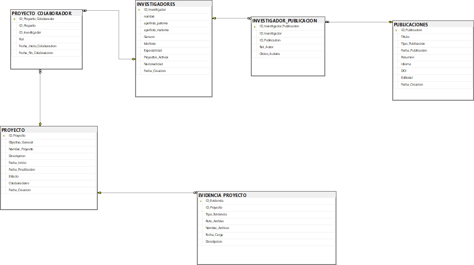

# Documentación de la Base de Datos: Gestión de Investigación

## Descripción general del proyecto

Esta base de datos está diseñada para administrar la actividad de investigación dentro de una institución académica o centro de desarrollo. El modelo permite un seguimiento integral de los investigadores, los proyectos que desarrollan, las publicaciones científicas que generan como resultado, y las evidencias (documentos, entregables) asociadas a dichos proyectos.

## Estructura del modelo

El modelo de datos se compone de 6 tablas en total:

* **Tablas de Entidad (Maestras):** Son las entidades principales del sistema.
    * `INVESTIGADORES`: Almacena el perfil de cada investigador.
    * `PROYECTO`: Contiene la información de cada proyecto de investigación.
    * `PUBLICACIONES`: Un catálogo de todos los artículos, *papers* o libros publicados.

* **Tablas Transaccionales (Detalle):**
    * `EVIDENCIA_PROYECTO`: Registra los archivos o evidencias vinculados a un proyecto.

* **Tablas de Unión (Asociativas):** Resuelven relaciones de muchos a muchos.
    * `PROYECTO_COLABORADOR`: Vincula a los investigadores con los proyectos en los que participan.
    * `INVESTIGADOR_PUBLICACION`: Vincula a los investigadores con las publicaciones de las que son autores.

## Relaciones entre tablas

El diseño de la base de datos establece las siguientes relaciones clave:

* **Muchos a Muchos (M:N) - `PROYECTO_COLABORADOR`:**
    * Un `PROYECTO` puede tener múltiples `INVESTIGADORES` colaborando en él.
    * Un `INVESTIGADOR` puede colaborar en múltiples `PROYECTO`s.
    * Esta relación se resuelve a través de la tabla `PROYECTO_COLABORADOR`.

* **Muchos a Muchos (M:N) - `INVESTIGADOR_PUBLICACION`:**
    * Un `INVESTIGADOR` puede ser autor de múltiples `PUBLICACIONES`.
    * Una `PUBLICACION` puede tener múltiples `INVESTIGADORES` (autores).
    * Esta relación se resuelve a través de la tabla `INVESTIGADOR_PUBLICACION`, la cual también almacena metadatos importantes como el rol y el orden de autoría.

* **Uno a Muchos (1:N) - `EVIDENCIA_PROYECTO`:**
    * Un `PROYECTO` puede tener múltiples `EVIDENCIA_PROYECTO` asociadas (ej. reportes, artículos, presentaciones).
    * Una `EVIDENCIA_PROYECTO` pertenece a un solo `PROYECTO`.
    * *Llave:* `EVIDENCIA_PROYECTO.ID_Proyecto` -> `PROYECTO.ID_Proyecto`

## Diagrama lógico

## Descripción de cada tabla

A continuación, se detalla la estructura y propósito de cada tabla definida en el script SQL.

### 1. INVESTIGADORES

Almacena el perfil y los datos demográficos del personal de investigación.

| Atributo | Tipo de Dato | Descripción |
| :--- | :--- | :--- |
| **ID_Investigador** | **integer (IDENTITY)** | **Llave Primaria (PK).** Identificador único autoincremental. |
| nombre | varchar(50) NOT NULL | Nombre(s) del investigador. |
| apellido_paterno | varchar(50) NOT NULL | Apellido paterno. |
| apellido_materno | varchar(50) | Apellido materno (opcional). |
| Genero | char(1) | Género del investigador (ej. 'M', 'F', 'O'). |
| telefono | varchar(15) | Número de contacto. |
| Especialidad | varchar(100) | Área principal de *expertise*. |
| Proyectos_Activos | tinyint (DEFAULT 0) | Contador de proyectos actualmente activos. |
| Nacionalidad | varchar(50) | País de origen o nacionalidad. |
| Fecha_Creacion | datetime2 (DEFAULT GETDATE()) | Marca de tiempo de la creación del registro. |

### 2. PROYECTO

Define los proyectos de investigación, sus objetivos, estado y duración.

| Atributo | Tipo de Dato | Descripción |
| :--- | :--- | :--- |
| **ID_Proyecto** | **integer (IDENTITY)** | **Llave Primaria (PK).** Identificador único del proyecto. |
| Objetivo_General | varchar(500) NOT NULL | Descripción clara del objetivo principal. |
| Nombre_Proyecto | varchar(150) NOT NULL | Título oficial del proyecto. |
| Descripcion | varchar(max) | Detalles adicionales, metodología, etc. |
| Fecha_Inicio | date NOT NULL | Fecha de inicio formal del proyecto. |
| Fecha_Finalizacion | date | Fecha de finalización (opcional si sigue activo). |
| Estado | varchar(30) (DEFAULT 'En Proceso') | Estado actual (ej. 'En Proceso', 'Completado', 'Pausado'). |
| Colaboradores | varchar(max) | *(Campo problemático, ver Consideraciones del Diseño)*. |
| Fecha_Creacion | datetime2 (DEFAULT GETDATE()) | Marca de tiempo de la creación del registro. |

### 3. EVIDENCIA_PROYECTO

Actúa como un repositorio de archivos o entregables asociados a un proyecto.

| Atributo | Tipo de Dato | Descripción |
| :--- | :--- | :--- |
| **ID_Evidencia** | **integer (IDENTITY)** | **Llave Primaria (PK).** Identificador único de la evidencia. |
| **ID_Proyecto** | **integer NOT NULL** | **Llave Foránea (FK).** Referencia a `PROYECTO(ID_Proyecto)`. |
| Tipo_Evidencia | varchar(50) NOT NULL | Categoría (ej. 'Reporte', 'Dataset', 'Presentación'). |
| Ruta_Archivo | varchar(255) | Ruta de almacenamiento del archivo (ej. URL, ruta de red). |
| Nombre_Archivo | varchar(100) NOT NULL | Nombre original del archivo. |
| Fecha_Carga | date (DEFAULT GETDATE()) | Fecha en que se cargó la evidencia. |
| Descripcion | varchar(max) | Breve descripción del contenido del archivo. |

### 4. PUBLICACIONES

Catálogo de todos los productos de investigación publicados.

| Atributo | Tipo de Dato | Descripción |
| :--- | :--- | :--- |
| **ID_Publicacion** | **integer (IDENTITY)** | **Llave Primaria (PK).** Identificador único de la publicación. |
| Titulo | varchar(200) NOT NULL | Título completo de la publicación. |
| Tipo_Publicacion | varchar(50) NOT NULL | Categoría (ej. 'Artículo de Revista', 'Capítulo de Libro', 'Conferencia'). |
| Fecha_Publicacion | date NOT NULL | Fecha oficial de publicación. |
| Resumen | varchar(max) | *Abstract* o resumen del contenido. |
| Idioma | varchar(30) | Idioma principal del texto. |
| DOI | varchar(100) | Identificador de Objeto Digital (Digital Object Identifier). |
| Editorial | varchar(100) | Nombre de la editorial o revista. |
| Fecha_Creacion | datetime2 (DEFAULT GETDATE()) | Marca de tiempo de la creación del registro. |

### 5. INVESTIGADOR_PUBLICACION

Tabla de unión que gestiona la autoría de las publicaciones.

| Atributo | Tipo de Dato | Descripción |
| :--- | :--- | :--- |
| **ID_Investigador_Publicacion** | **integer (IDENTITY)** | **Llave Primaria (PK).** Identificador único de la relación. |
| **ID_Investigador** | **integer NOT NULL** | **Llave Foránea (FK).** Referencia a `INVESTIGADORES(ID_Investigador)`. |
| **ID_Publicacion** | **integer NOT NULL** | **Llave Foránea (FK).** Referencia a `PUBLICACIONES(ID_Publicacion)`. |
| Rol_Autor | varchar(30) (DEFAULT 'Coautor')| Rol (ej. 'Autor Principal', 'Coautor', 'Corresponsal'). |
| Orden_Autoria | tinyint | Posición en la lista de autores (ej. 1, 2, 3). |

### 6. PROYECTO_COLABORADOR

Tabla de unión que gestiona la participación de investigadores en proyectos.

| Atributo | Tipo de Dato | Descripción |
| :--- | :--- | :--- |
| **ID_Proyecto_Colaborador** | **integer (IDENTITY)** | **Llave Primaria (PK).** Identificador único de la colaboración. |
| **ID_Proyecto** | **integer NOT NULL** | **Llave Foránea (FK).** Referencia a `PROYECTO(ID_Proyecto)`. |
| **ID_Investigador** | **integer NOT NULL** | **Llave Foránea (FK).** Referencia a `INVESTIGADORES(ID_Investigador)`. |
| Rol | varchar(50) | Rol en el proyecto (ej. 'Investigador Principal', 'Asistente'). |
| Fecha_Inicio_Colaboracion | date NOT NULL | Fecha de inicio de la participación. |
| Fecha_Fin_Colaboracion | date | Fecha de fin de la participación (opcional). |

## Consideraciones del diseño

1.  **Normalización:** El diseño utiliza tablas de unión (`PROYECTO_COLABORADOR` e `INVESTIGADOR_PUBLICACION`) para implementar correctamente las relaciones de muchos-a-muchos (M:N). Esto sigue la Tercera Forma Normal (3NF) y evita la duplicidad de datos.
2.  **Llaves Primarias (PK):** El uso de `integer IDENTITY(1, 1)` como llave primaria es una práctica estándar y eficiente en SQL Server. Asegura un identificador único y no nulo para cada registro sin necesidad de gestión manual.
3.  **Integridad Referencial:** Todas las relaciones lógicas están forzadas a nivel de base de datos mediante `FOREIGN KEY` constraints. Esto previene la creación de registros "huérfanos" (por ejemplo, una evidencia que no pertenezca a ningún proyecto).
4.  **Tipos de Datos:** Se emplean tipos de datos `varchar(max)` para campos de texto de longitud variable e impredecible (como `Descripcion` o `Resumen`), lo cual es apropiado. El uso de `datetime2` es preferible sobre `datetime` por su mayor precisión y cumplimiento del estándar SQL.
5.  **Valores por Defecto (DEFAULT):** El uso de `DEFAULT GETDATE()` para las fechas de creación y `DEFAULT` para campos como `Estado` o `Proyectos_Activos` simplifica la lógica de inserción de datos desde la aplicación.

