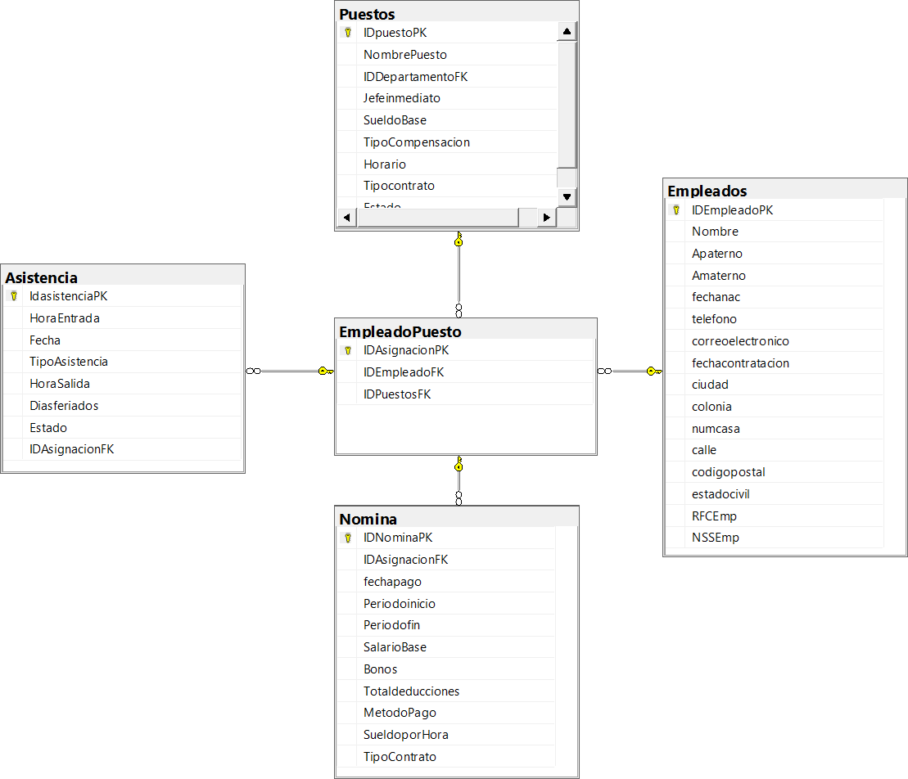

# Documentación de la Base de Datos: Recursos Humanos

## Descripción general del proyecto

Esta base de datos está diseñada para administrar un sistema de Recursos Humanos y Nómina. El modelo permite almacenar información detallada de los empleados, los puestos de trabajo que ofrece la organización, y la relación entre ellos.

El núcleo del sistema es la asignación (`EmpleadoPuesto`), que vincula a un empleado con un puesto específico. A partir de esta asignación central, el sistema registra eventos transaccionales clave, como la **Asistencia** (entradas, salidas) y la **Nómina** (pagos, deducciones) asociados a dicha asignación laboral.

## Estructura del modelo

El modelo de datos se compone de 5 tablas principales:

* **Empleados**: Tabla maestra que contiene toda la información demográfica, de contacto y legal de un empleado.
* **Puestos**: Tabla maestra que define los roles de trabajo, sus sueldos base y características.
* **EmpleadoPuesto**: Tabla de unión (o "asignación") que crea el vínculo entre un empleado y un puesto. Es la entidad central del modelo.
* **Asistencia**: Tabla transaccional que registra la asistencia diaria (entradas/salidas) de una asignación de empleado.
* **Nomina**: Tabla transaccional que registra los pagos de nómina (salarios, bonos, deducciones) para una asignación de empleado.

## Relaciones entre tablas

Este modelo utiliza la tabla `EmpleadoPuesto` como nexo central para gestionar las relaciones:

* **Muchos a Muchos (M:N) - `Empleados` y `Puestos`:**
    * Un `Empleado` puede ocupar múltiples `Puestos` a lo largo de su historia en la empresa (ej. un ascenso es una nueva asignación).
    * Un `Puesto` (ej. "Cajero") puede ser ocupado por múltiples `Empleados`.
    * Esta relación se resuelve a través de la tabla `EmpleadoPuesto`, donde cada registro (`IDAsignacionPK`) representa una instancia única de un empleado en un puesto.

* **Uno a Muchos (1:N) - `EmpleadoPuesto` a `Asistencia`:**
    * Una asignación (`EmpleadoPuesto`) puede tener múltiples registros de `Asistencia` a lo largo del tiempo.
    * *Llave:* `Asistencia.IDAsignacionFK` -> `EmpleadoPuesto.IDAsignacionPK`

* **Uno a Muchos (1:N) - `EmpleadoPuesto` a `Nomina`:**
    * Una asignación (`EmpleadoPuesto`) puede tener múltiples registros de `Nomina` (ej. un pago quincenal o mensual).
    * *Llave:* `Nomina.IDAsignacionFK` -> `EmpleadoPuesto.IDAsignacionPK`

## Diagrama lógico

## Descripción de cada tabla

A continuación, se detalla la estructura de cada tabla basada en el script SQL proporcionado.

### 1. Empleados

Almacena la información personal y de identificación de cada empleado.

| Atributo | Tipo de Dato | Descripción |
| :--- | :--- | :--- |
| **IDEmpleadoPK** | **INT** | **Llave Primaria (PK).** Identificador único del empleado. |
| Nombre | VARCHAR(50) NOT NULL | Nombre(s) del empleado. |
| Apaterno | VARCHAR(50) NOT NULL | Apellido paterno. |
| Amaterno | VARCHAR(50) | Apellido materno (opcional). |
| fechanac | DATE | Fecha de nacimiento. |
| telefono | VARCHAR(15) | Número de contacto. |
| correoelectronico | VARCHAR(100) | Correo electrónico. |
| fechacontratacion | DATE NOT NULL | Fecha de ingreso a la empresa. |
| ciudad | VARCHAR(60) | Ciudad de residencia. |
| colonia | VARCHAR(80) | Colonia de residencia. |
| numcasa | VARCHAR(10) | Número exterior/interior. |
| calle | VARCHAR(100) | Calle de residencia. |
| codigopostal | CHAR(5) | Código postal (longitud fija). |
| estadocivil | VARCHAR(20) | Estado civil (ej. 'Soltero', 'Casado'). |
| RFCEmp | CHAR(13) | RFC del empleado (longitud fija). |
| NSSEmp | CHAR(11) | Número de Seguridad Social (longitud fija). |

### 2. Puestos

Define los roles de trabajo, sus características y compensaciones.

| Atributo | Tipo de Dato | Descripción |
| :--- | :--- | :--- |
| **IDpuestoPK** | **INT** | **Llave Primaria (PK).** Identificador único del puesto. |
| NombrePuesto | VARCHAR(80) NOT NULL | Nombre descriptivo del puesto (ej. 'Analista Sr.'). |
| IDDepartamentoFK | INT | Llave foránea para un departamento. *(Ver Mejoras)*. |
| Jefeinmediato | VARCHAR(100) | Nombre del jefe directo (podría normalizarse). |
| SueldoBase | DECIMAL(10,2) NOT NULL | Salario base bruto asignado al puesto. |
| TipoCompensacion | VARCHAR(30) | Ej. 'Salario', 'Honorarios'. |
| Horario | VARCHAR(50) | Descripción del horario (ej. '9-5 L-V'). |
| Tipocontrato | VARCHAR(30) | Ej. 'Indefinido', 'Temporal'. |
| Estado | VARCHAR(20) | Ej. 'Activo', 'Vacante', 'Eliminado'. |

### 3. EmpleadoPuesto

Tabla central que vincula a un empleado con un puesto, creando una "asignación" única.

| Atributo | Tipo de Dato | Descripción |
| :--- | :--- | :--- |
| **IDAsignacionPK** | **INT** | **Llave Primaria (PK).** ID único de la asignación. |
| **IDEmpleadoFK** | **INT NOT NULL** | **Llave Foránea (FK).** Referencia a `Empleados(IDEmpleadoPK)`. |
| **IDPuestosFK** | **INT NOT NULL** | **Llave Foránea (FK).** Referencia a `Puestos(IDpuestoPK)`. |

### 4. Asistencia

Registro transaccional de las entradas y salidas de un empleado.

| Atributo | Tipo de Dato | Descripción |
| :--- | :--- | :--- |
| **IdasistenciaPK** | **INT** | **Llave Primaria (PK).** ID único del registro de asistencia. |
| HoraEntrada | TIME(0) | Hora de entrada (sin fracciones de segundo). |
| Fecha | DATE NOT NULL | Fecha del registro. |
| TipoAsistencia | VARCHAR(30) | Ej. 'Puntual', 'Retardo', 'Falta', 'Permiso'. |
| HoraSalida | TIME(0) | Hora de salida. |
| Diasferiados | VARCHAR(100) | Descripción si el día fue feriado. |
| Estado | BIT NOT NULL | Estado del registro (ej. 1=Procesado, 0=Pendiente). |
| **IDAsignacionFK** | **INT NOT NULL** | **Llave Foránea (FK).** Referencia a `EmpleadoPuesto(IDAsignacionPK)`. |

### 5. Nomina

Registro transaccional de los pagos de nómina generados.

| Atributo | Tipo de Dato | Descripción |
| :--- | :--- | :--- |
| **IDNominaPK** | **INT** | **Llave Primaria (PK).** ID único del recibo de nómina. |
| **IDAsignacionFK** | **INT NOT NULL** | **Llave Foránea (FK).** Referencia a `EmpleadoPuesto(IDAsignacionPK)`. |
| fechapago | DATE NOT NULL | Fecha en que se realiza el pago. |
| Periodoinicio | DATE NOT NULL | Fecha de inicio del período de pago. |
| Periodofin | DATE NOT NULL | Fecha de fin del período de pago. |
| SalarioBase | DECIMAL(10,2) NOT NULL | Salario base para este período (puede diferir del puesto). |
| Bonos | DECIMAL(10,2) | Monto de bonos o percepciones adicionales. |
| Totaldeducciones | DECIMAL(10,2) | Monto total de deducciones (ej. impuestos, préstamos). |
| MetodoPago | VARCHAR(30) | Ej. 'Transferencia', 'Cheque'. |
| SueldoporHora | DECIMAL(8,2) | Valor de la hora (si aplica). |
| TipoContrato | VARCHAR(30) | Tipo de contrato. *(Ver Mejoras, posible redundancia)*. |

## Consideraciones del diseño

1.  **Modelo de Asignación Central:** El diseño de usar `EmpleadoPuesto` como la entidad central es una fortaleza significativa. Permite un rastreo histórico robusto. Si un empleado cambia de puesto, se crea un nuevo registro en `EmpleadoPuesto`, y sus antiguos registros de asistencia y nómina permanecen ligados a la asignación anterior, preservando la integridad histórica.
2.  **Integridad Referencial:** El modelo utiliza correctamente `FOREIGN KEY` constraints para asegurar que no existan registros de nómina o asistencia que no estén vinculados a una asignación de empleado válida.
3.  **Tipos de Datos Específicos:** La elección de tipos de datos es adecuada. `DECIMAL(10,2)` es correcto para moneda, `DATE` y `TIME(0)` son eficientes para registros de asistencia, y `CHAR` se usa para campos de longitud fija (RFC, NSS, CP), lo cual optimiza el almacenamiento.
4.  **Claves Primarias Manuales:** El script define las llaves primarias como `INT` pero **no** como `IDENTITY` (autoincrementales). Esto implica que la lógica de la aplicación es responsable de generar y asignar un ID único para cada nuevo empleado, puesto, asignación, etc., lo cual puede ser complejo y propenso a errores de colisión.

