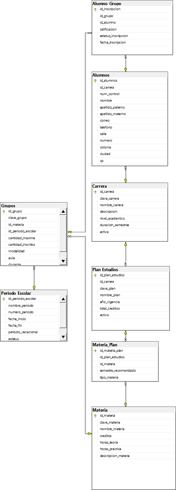

# Documentación de la Base de Datos: Servicios Escolares

## Descripción general del proyecto

Esta base de datos está diseñada para administrar los servicios escolares y el control académico de una institución educativa. El modelo de datos es centralizado y abarca desde la definición de la oferta académica (carreras, planes de estudio, materias) hasta la gestión operativa de los alumnos y su progreso.

El sistema gestiona la información de los **Alumnos**, su adscripción a una **Carrera** y un **Plan de Estudios** específico. También administra la operación semestral, definiendo los **Periodos Escolares** y los **Grupos** (cursos) que se ofertan en ellos. El núcleo transaccional del sistema es la tabla **Alumno_Grupo**, que representa la inscripción formal de un alumno en un grupo, permitiendo el registro de calificaciones.

## Estructura del modelo

El modelo de datos se compone de 8 tablas en total, que se pueden clasificar de la siguiente manera:

* **Tablas de Configuración Académica (Maestras):**
    * `Carrera`: Define las carreras que ofrece la institución.
    * `Plan_Estudios`: Define los diferentes planes (currículas) asociados a una carrera.
    * `Materia`: Catálogo de todas las materias disponibles.
* **Tablas Maestras Operativas:**
    * `Alumnos`: Contiene la información demográfica y de contacto de los estudiantes.
    * `Periodo_Escolar`: Define los semestres o ciclos escolares (ej. "Ene-Jun 2025").
* **Tablas de Unión (Asociativas):**
    * `Materia_Plan`: Resuelve la relación M:N entre `Plan_Estudios` y `Materia`. Define qué materias componen un plan.
    * `Alumno_Grupo`: Resuelve la relación M:N entre `Alumnos` y `Grupos`. Es el registro de la inscripción.
* **Tablas Transaccionales:**
    * `Grupos`: Representa la oferta de una materia en un periodo específico (ej. "Cálculo I, Gpo 1, Ene-Jun 2025").

## Relaciones entre tablas

El flujo de datos y las relaciones clave del modelo son las siguientes:

* **`Carrera` a `Alumnos` (1:N):** Una carrera (ej. "Ingeniería de Software") tiene múltiples alumnos inscritos.
    * *Llave:* `Alumnos.id_carrera` -> `Carrera.id_carrera`

* **`Carrera` a `Plan_Estudios` (1:N):** Una carrera puede tener múltiples planes de estudio a lo largo del tiempo (ej. "Plan 2018", "Plan 2024").
    * *Llave:* `Plan_Estudios.id_carrera` -> `Carrera.id_carrera`

* **`Plan_Estudios` y `Materia` (M:N) vía `Materia_Plan`:** Un plan de estudios se compone de múltiples materias, y una misma materia puede formar parte de múltiples planes de estudio.
    * *Llaves:* `Materia_Plan.id_plan_estudios` -> `Plan_Estudios.id_plan_estudios`
    * *Llaves:* `Materia_Plan.id_materia` -> `Materia.id_materia`

* **`Materia` a `Grupos` (1:N):** De una materia (ej. "Cálculo I") se pueden abrir múltiples grupos en diferentes periodos.
    * *Llave:* `Grupos.id_materia` -> `Materia.id_materia`

* **`Periodo_Escolar` a `Grupos` (1:N):** Durante un periodo escolar (ej. "Otoño 2025") se ofertan múltiples grupos.
    * *Llave:* `Grupos.id_periodo_escolar` -> `Periodo_Escolar.id_periodo_escolar`

* **`Alumnos` y `Grupos` (M:N) vía `Alumno_Grupo`:** Esta es la relación de inscripción. Un alumno puede inscribirse en múltiples grupos, y un grupo contiene múltiples alumnos.
    * *Llaves:* `Alumno_Grupo.id_alumno` -> `Alumnos.id_alumnos`
    * *Llaves:* `Alumno_Grupo.id_grupo` -> `Grupos.id_grupo`

## Diagrama lógico

## Descripción de cada tabla

### 1. Carrera

Define las carreras o programas académicos que ofrece la institución.

| Atributo | Tipo de Dato | Descripción |
| :--- | :--- | :--- |
| **id_carrera** | **INT IDENTITY(1,1)** | **Llave Primaria (PK).** Identificador único de la carrera. |
| clave_carrera | VARCHAR(20) UNIQUE | Clave de negocio única para la carrera (ej. "ISC"). |
| nombre_carrera | VARCHAR(100) NOT NULL | Nombre oficial de la carrera. |
| descripcion | VARCHAR(MAX) | Descripción detallada de la carrera. |
| nivel_academico | VARCHAR(30) | Nivel (ej. 'Licenciatura', 'Posgrado'). |
| duracion_semestres | TINYINT NOT NULL | Duración estándar de la carrera en semestres. |
| activa | BIT NOT NULL | Indica si la carrera está activa (1) o inactiva (0). |

### 2. Alumnos

Almacena la información demográfica, de contacto y académica de cada estudiante.

| Atributo | Tipo de Dato | Descripción |
| :--- | :--- | :--- |
| **id_alumnos** | **INT IDENTITY(1,1)** | **Llave Primaria (PK).** Identificador único del alumno. |
| **id_carrera** | **INT NOT NULL** | **Llave Foránea (FK).** Referencia a `Carrera(id_carrera)`. |
| num_control | CHAR(8) UNIQUE | Número de control o matrícula única del alumno. |
| nombre | VARCHAR(50) NOT NULL | Nombre(s) del alumno. |
| apellido_paterno | VARCHAR(50) NOT NULL | Apellido paterno. |
| apellido_materno | VARCHAR(50) | Apellido materno. |
| correo | VARCHAR(100) | Correo electrónico de contacto. |
| telefono | VARCHAR(15) | Teléfono de contacto. |
| calle, numero, colonia, ciudad, cp | VARCHARs/CHAR | Campos para la dirección postal del alumno. |

### 3. Plan_Estudios

Define una currícula o mapa curricular específico asociado a una carrera.

| Atributo | Tipo de Dato | Descripción |
| :--- | :--- | :--- |
| **id_plan_estudios** | **INT IDENTITY(1,1)** | **Llave Primaria (PK).** Identificador único del plan. |
| **id_carrera** | **INT NOT NULL** | **Llave Foránea (FK).** Referencia a `Carrera(id_carrera)`. |
| clave_plan | VARCHAR(20) UNIQUE | Clave de negocio única para el plan (ej. "ISC-2018"). |
| nombre_plan | VARCHAR(100) NOT NULL | Nombre descriptivo del plan. |
| año_vigencia | SMALLINT NOT NULL | Año en que el plan entró en vigor. |
| total_creditos | SMALLINT NOT NULL | Suma total de créditos necesarios para egresar. |
| activo | BIT NOT NULL | Indica si el plan está activo (1) o inactivo (0). |

### 4. Materia

Catálogo maestro de todas las materias (asignaturas) que pueden impartirse.

| Atributo | Tipo de Dato | Descripción |
| :--- | :--- | :--- |
| **id_materia** | **INT IDENTITY(1,1)** | **Llave Primaria (PK).** Identificador único de la materia. |
| clave_materia | VARCHAR(15) UNIQUE | Clave de negocio única de la materia (ej. "MAT-101"). |
| nombre_materia | VARCHAR(100) NOT NULL | Nombre oficial de la materia. |
| creditos | TINYINT NOT NULL | Número de créditos que otorga la materia. |
| horas_teoria | TINYINT | Horas de teoría a la semana. |
| horas_practica | TINYINT | Horas de práctica a la semana. |
| descripcion_materia | VARCHAR(MAX) | Temario o descripción de la materia. |

### 5. Materia_Plan

Tabla de unión que define la estructura de un plan de estudios (la "retícula").

| Atributo | Tipo de Dato | Descripción |
| :--- | :--- | :--- |
| **id_materia_plan** | **INT IDENTITY(1,1)** | **Llave Primaria (PK).** Identificador único de la asignación. |
| **id_plan_estudios** | **INT NOT NULL** | **Llave Foránea (FK).** Referencia a `Plan_Estudios(id_plan_estudios)`. |
| **id_materia** | **INT NOT NULL** | **Llave Foránea (FK).** Referencia a `Materia(id_materia)`. |
| semestre_recomendado | TINYINT | Semestre en el que se recomienda cursar la materia. |
| tipo_materia | VARCHAR(20) | Tipo (ej. 'Básica', 'Especialidad', 'Residencia'). |

### 6. Periodo_Escolar

Define los ciclos escolares (semestres, cuatrimestres) en los que opera la institución.

| Atributo | Tipo de Dato | Descripción |
| :--- | :--- | :--- |
| **id_periodo_escolar** | **INT IDENTITY(1,1)** | **Llave Primaria (PK).** Identificador único del periodo. |
| nombre_periodo | VARCHAR(50) NOT NULL | Nombre descriptivo (ej. "Otoño 2025"). |
| numero_periodo | SMALLINT NOT NULL | Número identificador del periodo. |
| fecha_inicio | DATE NOT NULL | Fecha de inicio del periodo. |
| fecha_fin | DATE NOT NULL | Fecha de fin del periodo. |
| periodo_vacacional | VARCHAR(100) | Descripción de las vacaciones dentro del periodo. |
| estatus | VARCHAR(20) NOT NULL | Estado (ej. 'Próximo', 'Activo', 'Cerrado'). |

### 7. Grupos

Representa la instancia de una materia que se oferta en un periodo específico, con un cupo y docente.

| Atributo | Tipo de Dato | Descripción |
| :--- | :--- | :--- |
| **id_grupo** | **INT IDENTITY(1,1)** | **Llave Primaria (PK).** Identificador único del grupo (curso). |
| clave_grupo | VARCHAR(20) UNIQUE | Clave de negocio única del grupo (ej. "MAT101-G1-OT25"). |
| **id_materia** | **INT NOT NULL** | **Llave Foránea (FK).** Referencia a `Materia(id_materia)`. |
| **id_periodo_escolar** | **INT NOT NULL** | **Llave Foránea (FK).** Referencia a `Periodo_Escolar(id_periodo_escolar)`. |
| cantidad_maxima | TINYINT NOT NULL | Límite de alumnos que pueden inscribirse. |
| cantidad_inscritos | TINYINT | Contador de alumnos inscritos actualmente. |
| modalidad | VARCHAR(30) | Ej. 'Presencial', 'En línea', 'Híbrido'. |
| aula | VARCHAR(20) | Aula asignada. *(Ver Posibles Mejoras)*. |
| docente | VARCHAR(100) | Nombre del docente. *(Ver Posibles Mejoras)*. |

### 8. Alumno_Grupo

Tabla transaccional que formaliza la inscripción de un alumno en un grupo. Es donde se registran las calificaciones.

| Atributo | Tipo de Dato | Descripción |
| :--- | :--- | :--- |
| **id_inscripcion** | **INT IDENTITY(1,1)** | **Llave Primaria (PK).** Identificador único de la inscripción. |
| **id_grupo** | **INT NOT NULL** | **Llave Foránea (FK).** Referencia a `Grupos(id_grupo)`. |
| **id_alumno** | **INT NOT NULL** | **Llave Foránea (FK).** Referencia a `Alumnos(id_alumnos)`. |
| calificacion | DECIMAL(4,2) | Calificación final (ej. 95.50). |
| estatus_inscripcion | VARCHAR(30) NOT NULL | Estado (ej. 'Inscrito', 'Baja', 'Aprobado', 'Reprobado'). |
| fecha_inscripcion | DATE NOT NULL | Fecha en que se realizó la inscripción. |

## Consideraciones del diseño

1.  **Normalización:** El modelo está bien normalizado. Utiliza tablas de unión (`Materia_Plan`, `Alumno_Grupo`) para resolver relaciones M:N, evitando la redundancia de datos.
2.  **Flexibilidad Académica:** La separación entre `Carrera`, `Plan_Estudios` y `Materia` es robusta. Permite a la institución actualizar planes de estudio o tener múltiples planes vigentes para una misma carrera sin afectar los registros históricos de los alumnos.
3.  **Integridad de Negocio:** El uso de restricciones `UNIQUE` en claves de negocio (ej. `num_control`, `clave_carrera`, `clave_materia`, `clave_grupo`) es excelente, ya que protege la integridad de los datos más allá de las llaves primarias artificiales (`IDENTITY`).
4.  **Claves Primarias:** El uso de `INT IDENTITY(1,1)` como llave primaria (surrogate key) en todas las tablas es una práctica estándar que simplifica las inserciones y los `JOINs`.

